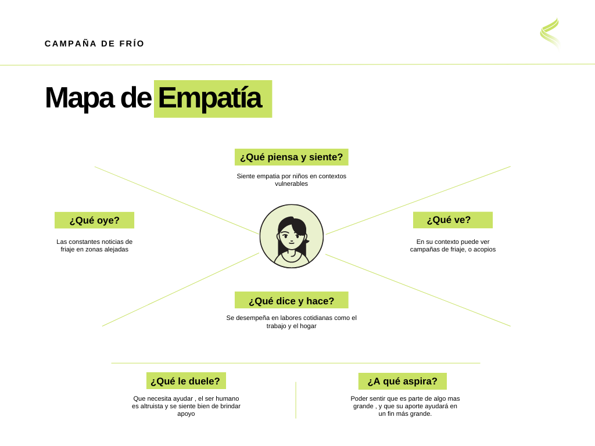
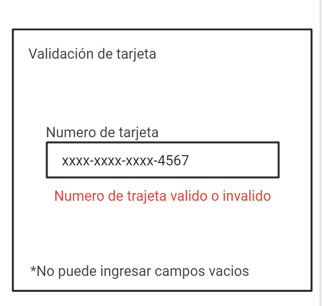
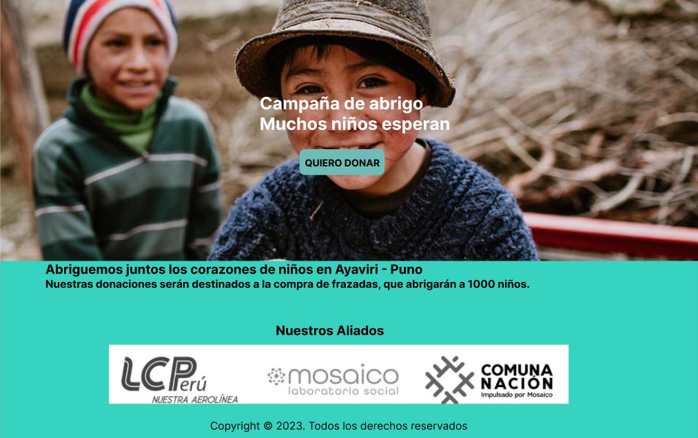
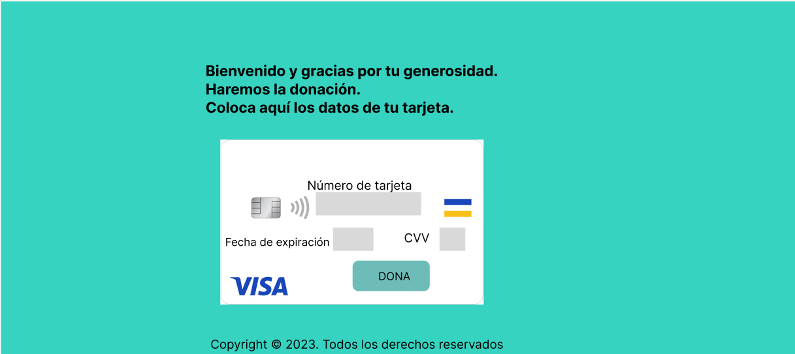

# Card Validation

# Indice
* [1.Definición de proyecto.](#-1.Definición-de-proyecto)
* [2.Los usuarios y los objetivos en relación con el producto.](#-2.Los-usuarios-y-los-objetivos-en-relación-con-el-producto.)
* [3.Flujo de trabajo](#-3.Flujo-de-trabajo)
* [4.Explicación de website](#-4.Explicación-de-website)

# 1.Definición de proyecto. 

El proyecto se trata de recaudar donaciones monetarias para comprar frazadas y llevarlas a Ayaviri-Puno. 

Se escogió la recaudación de campaña de frio ya que algunas localidades ubicadas sobre los 4000 m s.n. m. de los departamentos de Arequipa, Moquegua, Huancavelica, Cusco, Tacna y Puno, climáticamente presentan heladas meteorológicas durante todo el año(SENAMHI, 2010), acentuándose más entre el otoño, invierno y primavera(heladas permanentes). Es un tema que tiene relevancia social. 

# 2.Los usuarios y los objetivos en relación con el producto. 

Se adjunta un mapa de empatía donde se visualiza que los usuarios objetivo. 

 

## 2.1Cómo el producto soluciona los problemas/necesidades de dichos usuarios. 

El producto permite la recaudación mediante un proceso sencillo, que incluye la validación de la tarjeta y el enmascaramiento de los dígitos. 
# 3.Flujo de trabajo 
## 3.1 Early prototype 

## 3.2 Estructuracion de CSS y HTML.
Se estructuro siguiendo los css selectors,box model.

## 3.3 Aplicación de la funcionalidades isValid y Maskify

* IsValid para usar el [algoritmo de Luhn](https://es.wikipedia.org/wiki/Algoritmo_de_Luhn), que sirve para validar tarjetas y otros siguiendo el siguiente proceso: Se obtiene la reversa del número a verificar (que solamente contiene dígitos [0-9]); a todos los números que ocupan una posición par se les debe multiplicar por dos, si este número es mayor o igual a 10, debemos sumar los dígitos del resultado; el número a verificar será válido si la suma de sus dígitos finales es un múltiplo de 10.

* Maskify donde todos menos los últimos cuatro caracteres sean reemplazados por un numeral (#).
* En el proceso se vio el uso de condicionales,uso de bucles, pruebas unitarias.
## 3.4 Prototipo de alta fidelidad 

Se trabajo en un prototipo de alta fidelidad que incluia imagenes, display:flex, manipulación de eventos del DOM.

## 3.5 Elaboración del read.me
Explicar la información necesaria para el uso de tu aplicación web, así como una introducción a la aplicación, su funcionalidad y decisiones de diseño que tomaron.

# 4. Explicación de website
El usuario al ingresar ve un pagina informativa , donde se explica a que será destinada las donaciones , asi como los aliados que le da credibilidad al recaudo; posteriormente al dar click en el botón de "Quiero donar", se le envia a una pagina de pasarela de pagos, donde se hace la validación de los datos de su tarjeta cuando el usuario coloque sus datos.

 
